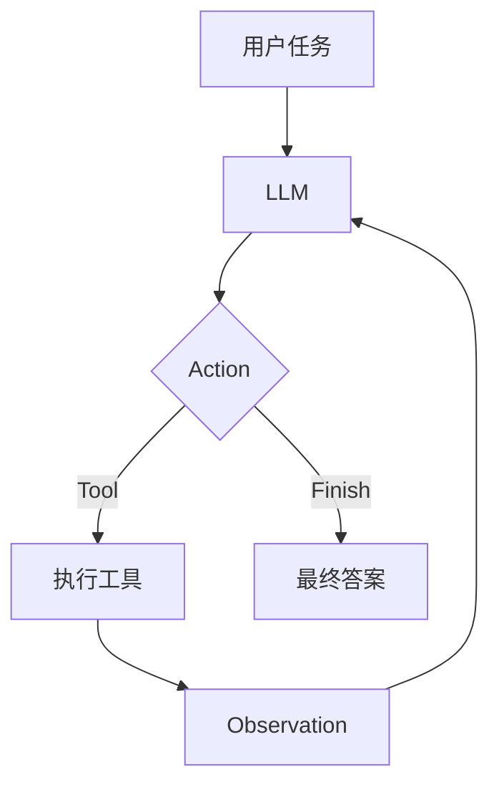

# Simple Agent 第一版章节写作规范（作者与维护者共用）

本文统一章节的写作结构、代码展示、图表、习题、引用和衔接方式，主要供作者与维护者共同使用。它约束内容质量，不要求每章机械保留所有标题。

> 维护说明：本文中的 `X`、`XX` 和 `vX.X` 是模板变量，用于表示任意章节或教学版本，不是尚未补写的书稿内容。本文不进入读者侧边栏或正式 PDF。

## 一、章节设计原则

每章只解决一个核心问题，并形成一个明确的新输出。

一章应当满足一条清晰的演化关系：

```text
上一章已有系统
→ 暴露一个具体缺陷
→ 引入一个新概念
→ 修改最少代码
→ 运行成功案例
→ 制造失败案例
→ 得到新的系统状态
→ 引出下一章
```

每章应围绕以下问题给出稳定回答：

```text
为什么需要本章？
本章新增了什么？
输入是什么？
输出是什么？
它负责什么？
它不负责什么？
删除它会怎样失败？
下一章为什么仍然需要继续？
```

## 二、章节头部模板

建议使用：

```markdown
# 第 X 章 章节标题

上一章中，我们已经实现了……

然而，当前系统仍然无法……

本章只解决一个问题：……

> **本章核心问题**
>
> ……
>
> **输入**
>
> ……
>
> **输出**
>
> ……
>
> **当前版本**
>
> `Simple Travel Assistant vX.X`
>
> **对应代码**
>
> `code/chapterXX/`

本章不会实现……
```

头部控制在 4～7 个自然段，不要连续罗列十几个“本章将研究”。

## 三、标准章节骨架

### X.1 当前系统遇到了什么问题

使用主线旅行助手提出一个具体问题。

要求：

1. 先展示当前程序可以做什么；
2. 再展示它在哪里失败；
3. 失败必须与本章核心问题直接相关；
4. 不先给抽象定义；
5. 不重复上一章完整内容。

示例：

```text
第四章已经能够执行工具，但工具名称仍由开发者写死。
当用户输入自然语言任务时，程序无法自动选择工具。
```

### X.2 核心概念

只在本节给出本章唯一的正式定义。

模板：

```markdown
在本书中，我们采用下面的工程化定义：

> **术语**是……
```

随后说明：

```text
输入
输出
职责
边界
```

若概念已经在术语表中定义，本章只引用，不重新完整定义。

### X.3 它位于系统的什么位置

用一张紧凑结构说明新增组件与已有组件的关系。

简单线性关系：

```text
用户任务 → LLM → Action → Parser → AgentAction
```

复杂关系才使用 Mermaid 或正式架构图。

本节重点回答：

```text
它接收谁的输出？
它把结果交给谁？
它是否改变环境？
它是否影响下一轮模型？
```

### X.4 增量设计

说明本章修改哪些文件。

固定格式：

```markdown
本章代码变化：

**沿用**

- `llm.py`
- `tools.py`

**新增**

- `parser.py`

**修改**

- `main.py`
```

本节只解释设计，不粘贴完整代码。

### X.5 最小实现

正文只展示当前需要理解的核心代码。

代码块前必须说明：

```text
为什么需要这段代码
输入是什么
输出是什么
```

代码块后必须说明：

```text
关键分支
错误边界
与上一章的变化
```

完整代码统一链接：

```markdown
本章完整代码见对应的 `code/chapterXX/` 目录。正式写作时，应把 `XX` 替换为真实章节编号并添加有效链接。
```

### X.6 运行主线案例

统一展示：

```text
用户输入
模型输出
程序解析
工具执行
最终输出
```

根据章节实际能力裁剪。

推荐格式：

````markdown
**用户输入**

```text
……
```

**关键运行过程**

```text
……
```

**最终结果**

```text
……
```
````

运行案例必须使用 Simple Travel Assistant，不要切换到无关项目。

### X.7 失败实验

每章至少保留一个失败实验。

失败实验必须说明：

```text
如何制造失败
实际发生什么
失败位于哪一层
当前系统如何处理
后续章节是否会改善
```

示例：

```text
删除历史消息后，再询问“它适合雨天吗？”
模型无法可靠判断“它”指什么。
```

失败实验不是“常见问题大全”，只选择最能证明本章必要性的一个案例。

### X.8 当前系统快照

每章结尾固定展示当前系统状态。

模板：

````markdown
## X.8 当前系统快照

本章结束后，旅行助手已经具备：

- ……
- ……

当前流程为：

```text
……
```

它仍然不能：

- ……

下一章将解决：

> ……
````

这部分负责全书衔接，不再使用泛泛的“下一章更精彩”。

### X.9 本章小结

使用 3～5 个问题回顾，不重复整章段落。

示例：

```markdown
完成本章后，应当能够回答：

1. Tool Result 与 Observation 有什么区别？
2. 为什么 `print()` 不等于模型看到了结果？
3. Observation 为什么必须进入下一轮上下文？
```

### 习题

每章最多 3～5 题，分为三类。

```text
理解题
修改题
失败实验题
```

模板：

```markdown
## 习题

**1. 理解题**

……

**2. 修改题**

……

**3. 失败实验**

……
```

不要把每道题拆成独立三级标题。

### 参考资料

只列本章真正使用的资料。

模板：

```markdown
## 参考资料

1. 作者. 标题. 会议或文档，年份.
2. 官方文档名称.
```

若在线站点支持脚注，可以使用脚注；若使用编号引用，全文格式必须统一。

## 四、可选章节结构

不同章节可以增加必要小节，但必须服务于唯一核心问题。

### 对比章节

适用于第 1、9、10、11 章。

可以增加：

```text
概念对比表
适用场景
局限
```

但完整的三范式总比较只保留在第三部分总结。

### 工程章节

适用于第 12～15 章。

可以增加：

```text
错误分类
数据结构
模块职责
测试矩阵
依赖关系
```

二级标题可放宽到 10～12 个，但不得无限拆分。

### 最终整合章节

适用于第 16 章。

可以增加：

```text
项目结构
配置
运行
查看轨迹
失败处理
能力边界
```

本章不再正式定义新的底层核心概念。

## 五、标题粒度规则

### 二级标题

用于真正独立的论点或步骤。

建议数量：

```text
普通章节：7～10 个
工程章节：8～12 个
```

### 三级标题

只有在以下情况使用：

```text
同一二级主题中存在两个以上真正独立子问题
每个子问题至少有完整论述
```

若三级标题下不足约 100 字，优先改成段落内加粗短语。

### 四级标题

主线正文原则上不用。复杂 API 字段说明优先使用表格。

## 六、段落规则

1. 避免连续多个只有一句话的短段落；
2. 相关内容合并为 3～5 句话的完整论述；
3. 每段只承担一个主要论点；
4. 关键结论用加粗或引用块；
5. 不用大量分隔线制造节奏；
6. 不重复解释同一概念；
7. 避免每段都以“需要注意的是”开头；
8. 过渡句必须说明逻辑关系，而不是只说“接下来继续”。

## 七、列表与表格规则

### 使用列表的情况

```text
步骤
并列条件
简短职责
检查清单
```

### 使用表格的情况

```text
两个以上维度对比
字段说明
错误分类
章节输入输出
模块职责
```

### 不适合列表的情况

若每项只有几个词且逻辑连续，优先写成一句话或内联链：

```text
LLM → Action → Parser → Tool
```

## 八、流程图规则

简单线性流程不使用高大的垂直箭头图。

推荐：

```text
用户任务 → LLM → Action → Parser → Tool
```

复杂分支可以使用 Mermaid：



全书核心图应保持统一视觉风格和术语。

## 九、代码规则

### 正文展示什么

```text
新增接口
关键分支
协议结构
核心循环
失败处理
```

### 正文不展示什么

```text
未修改的完整旧代码
大量导入
重复配置
完整数据字典
样板日志配置
测试中的重复 fixture
```

### 完整代码放置

```text
code/chapterXX/
simple_agent/
examples/
tests/
```

### 代码注释

注释解释“为什么”，不要逐行翻译代码。

不推荐：

```python
# 定义变量 step
step = 0
```

推荐：

```python
# 格式重试仍属于同一个 Agent Step，因此不会递增 step。
step = 0
```

### 类型标注

教学代码尽量使用清晰类型：

```python
def parse_action(model_output: str) -> AgentAction:
    ...
```

避免过早引入复杂泛型和抽象基类。

### 异常处理

不要使用宽泛的：

```python
except Exception:
    pass
```

预期失败应转换为明确结果；程序缺陷应在开发阶段暴露。

## 十、术语规则

首次正式定义：

```text
中文名称（English Term）
```

例如：

```text
行动（Action）
观察（Observation）
```

后续统一使用一种主表达。

代码对象使用反引号：

```text
`AgentAction`
`AgentState`
`finish`
```

一般概念不必每次加反引号。

同一术语不得在不同章节使用互相冲突的定义。

## 十一、公式规则

公式只用于压缩已经讲清楚的关系，不用来代替解释。

使用顺序：

```text
先用自然语言说明
再给公式
随后解释符号
最后回到代码
```

每章最多保留少量必要公式。

## 十二、边界说明规则

每章只保留与当前核心问题直接相关的边界。

推荐：

```text
本章只判断 Action 是否合法，不负责重试。
```

不推荐在每章重复长列表：

```text
本章不实现 RAG、MCP、多智能体、浏览器、异步、流式……
```

高级能力边界集中放在前言和第十六章。

## 十三、章节衔接规则

章节开头只回顾上一章中与当前问题直接相关的结果。

不推荐：

```text
在前面的章节中，我们已经完成了……
```

然后回顾五章内容。

推荐：

```text
上一章已经能够让模型生成 JSON Action，但该输出仍然只是一个不可信字符串。
```

章节结尾必须产生一个未解决问题：

```text
Parser 已经获得合法 AgentAction，但模型仍然不知道工具执行结果。
```

下一章开头直接接住这个问题。

## 十四、习题规则

每章习题围绕当前概念，不提前要求后续能力。

### 理解题

检查概念边界。

示例：

```text
为什么 `json.loads()` 成功不代表 Action 可以执行？
```

### 修改题

对当前代码做小范围修改。

示例：

```text
为 `get_weather` 增加一个新的模拟城市。
```

### 失败实验题

主动破坏当前组件。

示例：

```text
让模型输出缺少 `arguments` 的 JSON，观察 Parser 返回什么错误。
```

避免：

```text
要求读者一次实现完整异步多智能体平台
```

## 十五、引用与参考资料规则

1. 优先引用论文、官方文档和原始项目；
2. 参考资料必须与正文实际内容对应；
3. 不保留失效链接或未定义的引用编号；
4. 不在正文大段复制来源文字；
5. 对经典范式说明来源，但本书实现可以明确标注为教学化工程版本；
6. 全书统一一种引用格式。

## 十六、章节前置元信息

在线站点可以在每章开头加入：

```markdown
> **预计阅读时间**：30 分钟  
> **前置章节**：第 X 章  
> **当前版本**：Simple Travel Assistant vX.X  
> **对应代码**：`code/chapterXX/`
```

若后续使用 MkDocs，可迁移到 YAML Front Matter。

## 十七、章节变更卡

每次改章前填写：

```markdown
# 第 X 章变更卡

## 核心问题

……

## 输入

……

## 输出

……

## 保留的写作规则

- …

## 从其他章节迁入

- …

## 移到后续章节

- …

## 删除的重复内容

- …

## 正式定义术语

- …

## 只引用术语

- …

## 主线项目变化

- …

## 代码变化

**沿用**

- …

**新增**

- …

**修改**

- …

## 成功案例

……

## 失败案例

……

## 下一章依赖

……
```

## 十八、章节验收清单

完成后逐项检查：

- [ ] 本章只有一个核心问题；
- [ ] 输入和输出明确；
- [ ] 使用统一旅行助手主线；
- [ ] 新增概念有唯一正式定义；
- [ ] 没有重新完整解释别章术语；
- [ ] 代码只展示本章增量；
- [ ] 完整代码路径有效；
- [ ] 至少有一个成功案例；
- [ ] 至少有一个失败实验；
- [ ] 当前系统快照准确；
- [ ] 下一章问题自然产生；
- [ ] 习题不提前使用后续能力；
- [ ] 引用真实有效；
- [ ] 删除内容已经登记迁移位置；
- [ ] 标题数量和段落密度合理。

## 十九、完整 Markdown 模板

````markdown
# 第 X 章 章节标题

上一章中，我们已经……

然而，当前系统仍然……

本章只解决一个问题：……

> **本章核心问题**
>
> ……
>
> **输入**
>
> ……
>
> **输出**
>
> ……
>
> **当前版本**
>
> `Simple Travel Assistant vX.X`
>
> **对应代码**
>
> `code/chapterXX/`

本章不会……

## X.1 当前系统遇到了什么问题

……

## X.2 核心概念

在本书中，我们采用下面的工程化定义：

> **术语**是……

……

## X.3 它位于系统的什么位置

```text
……
```

……

## X.4 增量设计

本章代码变化：

**沿用**

- `...`

**新增**

- `...`

**修改**

- `...`

## X.5 最小实现

……

```python
...
```

……

完整代码见对应的 `code/chapterXX/` 目录。发布前应把占位编号替换为真实章节编号并添加有效链接。

## X.6 运行主线案例

**用户输入**

```text
……
```

**关键运行过程**

```text
……
```

**最终结果**

```text
……
```

## X.7 失败实验

……

## X.8 当前系统快照

本章结束后，旅行助手已经具备：

- ……

当前流程：

```text
……
```

它仍然不能：

- ……

下一章将解决：

> ……

## X.9 本章小结

完成本章后，应当能够回答：

1. ……
2. ……
3. ……

## 习题

**1. 理解题**

……

**2. 修改题**

……

**3. 失败实验**

……

## 参考资料

1. ……
````

## 术语使用规则


1. 首次出现写作“中文（English）”；
2. 代码对象使用反引号；
3. 同一术语在全书保持同一含义；
4. 一般概念与具体数据结构分开命名；
5. Tool Result 与 Observation 不混用；
6. Step 与 Attempt 不混用；
7. State、Trace、Log 和 User Output 不混用；
8. ReAct、Plan-and-Solve 和 Reflection 不写成线性升级关系；
9. AgentAction 表示“通过校验”，不表示“执行成功”；
10. Finish 表示正常结束请求，真正停止仍由 Controller 执行。
